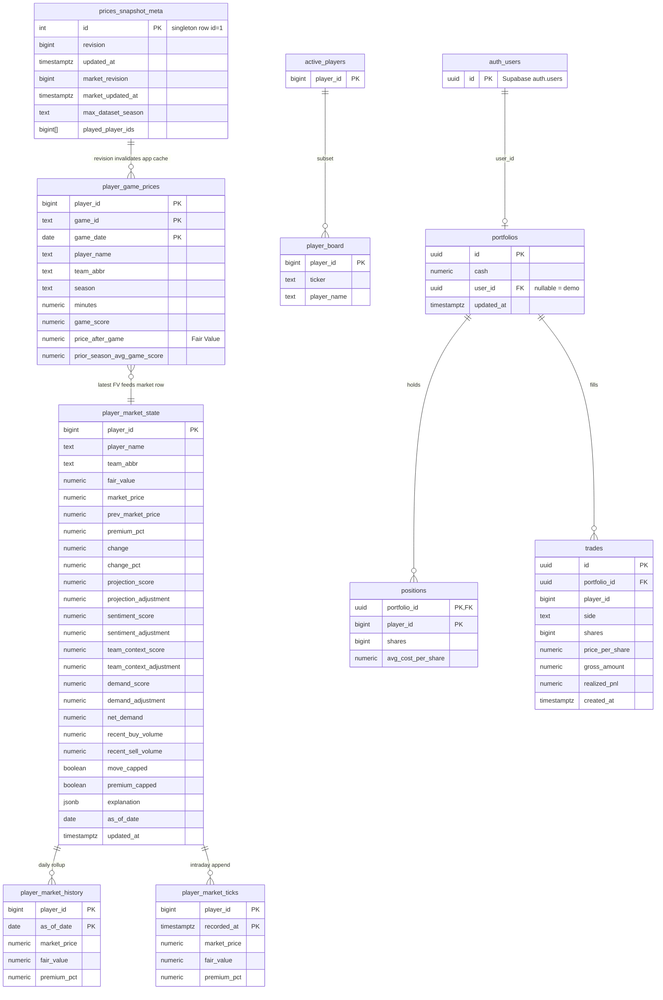
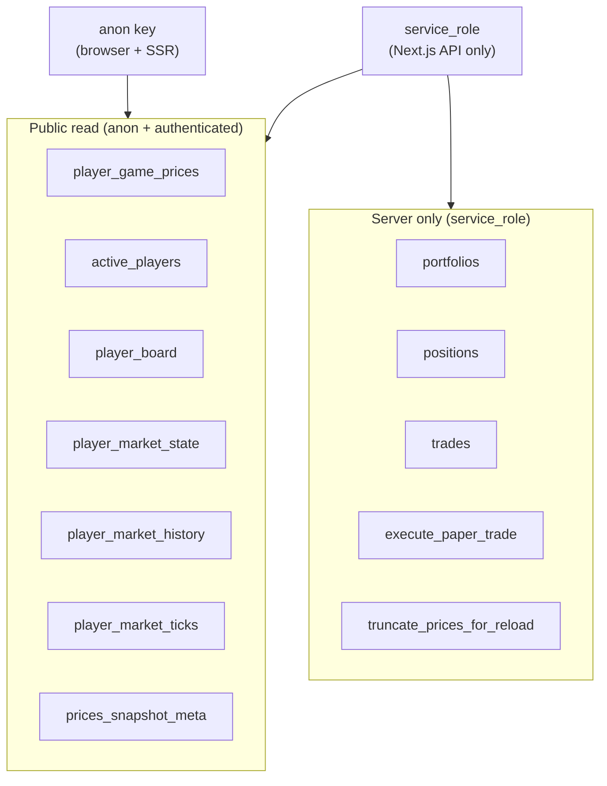

# Database Architecture

Supabase Postgres is the system of record for **hosted prices**, **market state**, and **paper portfolios**. Fair Value history can be rebuilt from CSV; portfolio and trade data are authoritative only in the database.

---

## 1. Database schema diagram

---

## 2. Table groups and responsibilities

### 2.1 Layer 1 — Fair Value (reloaded each sync)

| Table | Rows | Written by | Read by |
|-------|------|------------|---------|
| `player_game_prices` | One per player per game | `sync_prices_to_supabase.py` (truncate + insert) | Next.js `marketData.ts` (anon SELECT) |
| `active_players` | Current tradable roster IDs | Same sync | Filter board to active NBA players |
| `player_board` | One per active player | Same sync (tickers from `ticker_assign.py`) | Market table, player pages |
| `prices_snapshot_meta` | Singleton | `bump_prices_revision()`, sync updates season fields | Cache key for price bundle |

**Design intent:** Fair Value is derived entirely from batch CSV output. The database mirrors `data/player_game_prices.csv` for Vercel deployments that do not mount the repo `data/` folder.

### 2.2 Layer 2 — Market Price (upserted each cycle)

| Table | Rows | Written by | Read by |
|-------|------|------------|---------|
| `player_market_state` | One per active player | `update_market_state.py` upsert | `marketState.ts`, quotes, trade mid |
| `player_market_history` | One per player per calendar day | Daily upsert | Long-horizon charts |
| `player_market_ticks` | One per player per pipeline cycle | Insert (append) | Intraday stock-style charts |
| `prices_snapshot_meta.market_revision` | Singleton field | `bump_market_revision()` | Invalidate market cache without new games |

**Design intent:** Market Price retains **memory** across cycles (`prev_market_price`, sentiment EMA). Unlike Layer 1, these tables are never truncated in production.

### 2.3 Paper trading (transactional)

| Table | Rows | Written by | Read by |
|-------|------|------------|---------|
| `portfolios` | One per user (+ demo seed) | Auth trigger `handle_new_user`, trade RPC | `portfolioStore.ts` (service role) |
| `positions` | Open lots | `execute_paper_trade` | Portfolio page, P&L |
| `trades` | Append-only fills | `execute_paper_trade` | Activity feed, `demand_engine` input |

---

## 3. Stored procedures and triggers

| Object | Type | Caller | Purpose |
|--------|------|--------|---------|
| `truncate_prices_for_reload()` | `SECURITY DEFINER` | `service_role` | Atomic wipe of Layer 1 tables before bulk insert |
| `bump_prices_revision()` | SQL | `service_role` | Increment `revision` after Fair Value reload |
| `bump_market_revision()` | SQL | `service_role` | Increment `market_revision` after market cycle |
| `execute_paper_trade(...)` | PL/pgSQL | `service_role` via `/api/trade` | Atomic buy/sell with weighted avg cost basis |
| `handle_new_user()` | Trigger on `auth.users` | Supabase Auth | Create `$100,000` portfolio on signup |

---

## 4. Row-level security (RLS) model

**Why this split:** Market data is intentionally public for browse/guest mode. Paper money must not be writable from the client, even with a leaked anon JWT.

---

## 5. Migration apply order

Run once in Supabase SQL Editor (order matters):

1. `init_paper_market.sql` — `portfolios`, `positions`, demo seed
2. `per_user_portfolios.sql` — `user_id`, signup trigger
3. `trades_and_cost_basis.sql` — `trades`, `execute_paper_trade`, `avg_cost_per_share`
4. `lockdown_paper_portfolio.sql` — revoke anon on portfolio tables (if upgrading legacy deploy)
5. `prices_tables.sql` — Layer 1 tables + `truncate_prices_for_reload`
6. `prices_meta_snapshot.sql` — `max_dataset_season`, `played_player_ids`
7. `player_board.sql` — tickers + extended truncate RPC
8. `market_price_layer.sql` — Layer 2 tables + `bump_market_revision`
9. `market_price_ticks.sql` — optional if layer file already includes ticks

---

## 6. Indexes (performance-critical)

| Index | Table | Columns | Use case |
|-------|-------|---------|----------|
| `idx_player_game_prices_player_order` | `player_game_prices` | `(player_id, game_date, game_id)` | Per-player history, latest row |
| `idx_player_market_state_market_price` | `player_market_state` | `market_price DESC` | Leaderboards / top movers |
| `idx_player_market_history_player_date` | `player_market_history` | `(player_id, as_of_date)` | Chart time series |
| `idx_player_market_ticks_player_time` | `player_market_ticks` | `(player_id, recorded_at DESC)` | Intraday charts |
| `trades_portfolio_created_idx` | `trades` | `(portfolio_id, created_at DESC)` | Portfolio activity feed |

---

## 7. Cache invalidation contract

The web app does not subscribe to Realtime for prices. Instead:

| Signal | Field | When bumped |
|--------|-------|-------------|
| Fair Value reload | `prices_snapshot_meta.revision` | After `sync_prices_to_supabase.py` |
| Market cycle | `prices_snapshot_meta.market_revision` | After `update_market_state.py` |

`marketData.ts` and `marketState.ts` embed these values in cache keys so a deploy without code changes picks up new data on the next request after the pipeline runs.

---

## 8. Design decisions

### Composite primary key on game prices

`(player_id, game_id, game_date)` prevents duplicate game rows and matches CSV grain.

### Separate `market_revision` from `revision`

Fair Value can reload without recomputing market state in failure scenarios, and market can tick between games without rewriting the entire game-price table.

### JSON `explanation` on market state

Stores lever breakdowns and driver strings for UI transparency without normalizing lever tables prematurely.

### Weighted-average cost in Postgres

Cost basis logic lives in `execute_paper_trade` so concurrent trades serialize on portfolio row lock (`FOR UPDATE`).

---

## 9. Current bottlenecks

| Issue | Detail |
|-------|--------|
| **Full table truncate on sync** | Brief window where `player_game_prices` is empty mid-job |
| **No partitioning on ticks** | `player_market_ticks` grows ~2×/hour × active players |
| **Demand query scans trades** | `update_market_state.py` paginates recent trades globally each cycle |
| **Large array on meta row** | `played_player_ids` can be wide; reread every bundle build |
| **PostgREST row cap** | Project “Max rows” must align with app page size or reads silently truncate |

---

## 10. Future scaling improvements

1. **Staging tables + swap** — `player_game_prices_staging` → rename/swap pointer in meta row.
2. **Partition `player_market_ticks` by month** — drop old partitions via cron.
3. **Materialized view `market_board_latest`** — denormalize join of board + market state + latest FV.
4. **Partial index on recent trades** — `(created_at DESC)` with time predicate for demand window only.
5. **Read-only replica** for analytics dashboards hitting history tables.
6. **Supabase Realtime** (optional) — push `market_revision` to clients instead of polling meta.
7. **Move `played_player_ids` to junction table** — if array size becomes unwieldy.

---

## Related documents

- [SYSTEM_ARCHITECTURE.md](./SYSTEM_ARCHITECTURE.md)
- [DATA_PIPELINE.md](./DATA_PIPELINE.md)
- [MARKET_PRICING_ENGINE.md](./MARKET_PRICING_ENGINE.md)
