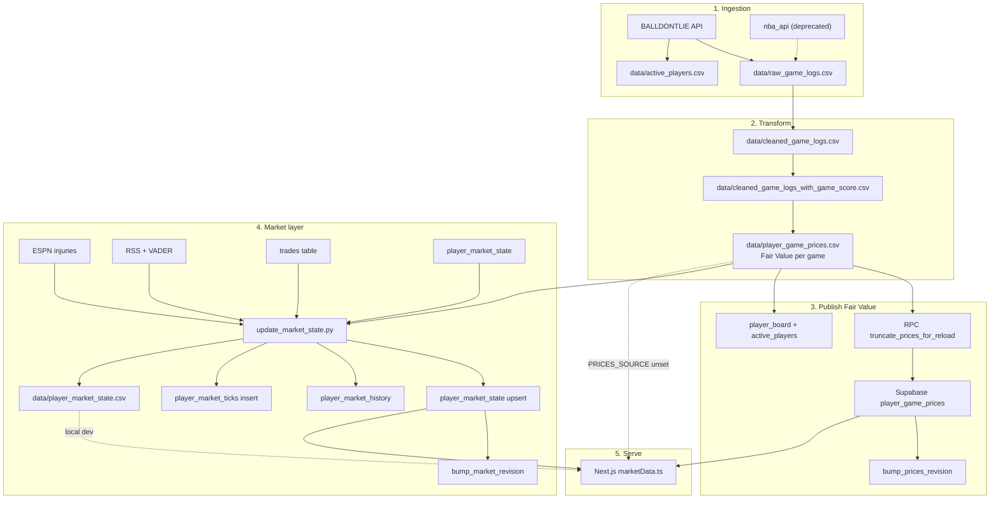
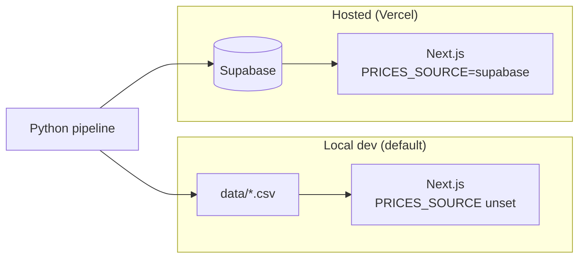

# Data Pipeline

The pipeline transforms **raw NBA box scores** into **Fair Value time series**, publishes them to Supabase, then advances **Market Price** with explainable levers. This document traces every stage, file artifact, and design trade-off.

---

## 1. End-to-end data flow diagram

---

## 2. Pipeline stages (detailed)

### Stage 1 — Ingestion

**Entry:** `python pipeline/run_pipeline.py --fetch-balldontlie --active`

| Step | Module | Output |
|------|--------|--------|
| Season window | `season_window.py` | Prior + current season years (unless `--bootstrap-history`) |
| Fetch logs | `balldontlie_fetch.py` (incremental `start_date` + GitHub Actions cache restore/save) | `data/raw_game_logs.csv` |
| Active roster | `balldontlie_fetch.save_active_players_bdl()` | `data/active_players.csv` |
| Player birth dates / positions | `player_profiles.csv` (committed; incremental sync for new roster ids only) | `data/player_profiles.csv` — **age computed at market time** from `birth_date` |

**Alternate path:** `--fetch` uses `data_collection.py` + `nba_api` (deprecated; incompatible player IDs).

**Design decision — prior + current season only:** Prior season supplies IPO anchors and benchmarks; current season drives live prices. Full history is opt-in (`--bootstrap-history`) to limit API volume.

**Data included:** Regular season and playoffs. Minutes = 0 games may exist but do not count as “played” for board filters.

---

### Stage 2 — Cleaning and feature engineering

| Step | Module | Input → Output |
|------|--------|----------------|
| Clean | `data_cleaning.py` | `raw_game_logs.csv` → `cleaned_game_logs.csv` |
| Game score | `game_score.py` | Adds Hollinger GmSc → `cleaned_game_logs_with_game_score.csv` |

**Game score formula (Hollinger GmSc):** Box-score composite (points, shooting efficiency, rebounds, assists, steals, blocks, fouls, turnovers). Standard analytics primitive for per-game productivity.

---

### Stage 3 — Fair Value (Layer 1)

**Module:** `price_engine.py`  
**Output:** `data/player_game_prices.csv`

Per-player, per-season logic:

1. **Season-open IPO** — Blend of league percentile (minutes-adjusted prior-season mean GmSc) and direct dollar mapping; rookies get a floor anchor (`ROOKIE_IPO_PRICE`).
2. **Per-game update** — Exponential smoothing toward a target mixing tonight’s game, prior-season reputation, and season-to-date average.
3. **Early-season damping** — Lower `alpha` for first five games to reduce noise.
4. **Between games** — Price flat until next game logged.

Key constants (see `price_engine.py`): `ALPHA=0.25`, `PRICE_MAX=185`, ceiling `PRICE_MAX+55` for absolute clamp shared with market layer.

**Validation:** `validate_prices.py` runs before pipeline exits non-zero on anomalies.

---

### Stage 4 — Sync to Supabase

**Entry:** `python pipeline/sync_prices_to_supabase.py`

1. `truncate_prices_for_reload()` — wipes `player_board`, `player_game_prices`, `active_players`
2. Batch insert all game rows (`BATCH=1000`)
3. Insert active IDs
4. Compute `max_dataset_season`, `played_player_ids` (players with minutes > 0 in max season)
5. Build `player_board` with `ticker_assign.assign_player_tickers`
6. `bump_prices_revision()`

**Design decision — full reload:** Correctness and simplicity over incremental diffing. Revision bump invalidates Next.js in-memory caches.

---

### Stage 5 — Market Price (Layer 2)

**Entry:** `python pipeline/update_market_state.py` (runs after sync in CI)

For each active player:

| Input | Source |
|-------|--------|
| Fair Value | Latest `price_after_game` from CSV |
| Season games | Current-season rows from CSV |
| Prior anchor | `prior_season_avg_game_score` |
| Previous market price | `player_market_state` (or local CSV fallback) |
| Previous sentiment | EMA continuity from prior `sentiment_score` |
| Team win % | Derived from W/L in CSV (`result` column) |
| Injuries | `espn_injuries.fetch_injuries()` |
| News | `news_sentiment.fetch_news_sentiment()` (VADER on RSS) |
| Demand | Recent `trades` in 7-day window, per-user capped |

**Outputs:**

- Upsert `player_market_state` (500-row batches)
- Upsert `player_market_history` for today
- Insert `player_market_ticks` with `recorded_at = now()`
- `bump_market_revision()`
- Local mirrors: `player_market_state.csv`, append `player_market_ticks.csv`

**Design decision — read Fair Value from CSV in same job:** Avoids scanning millions of game rows from Postgres when the file was just written locally in CI.

---

## 3. Orchestration entry points

| Command | What runs |
|---------|-----------|
| `run_pipeline.py` | Stages 1–3 (optional fetch) |
| `sync_prices_to_supabase.py` | Stage 4 |
| `update_market_state.py` | Stage 5 |
| `update_market_local.py` | All of the above (production parity) |
| GitHub Actions `update-market-prices.yml` | fetch → pipeline → sync → market |

**CI schedule:** `15,45 * * * *` UTC (twice hourly).

---

## 4. Local vs hosted data paths

`web/lib/paths.ts` resolves `../data` relative to `web/` cwd. Production sets `PRICES_SOURCE=supabase` so Vercel does not depend on repo `data/` at runtime.

---

## 5. Player ID integrity

| Source | ID space | Use |
|--------|----------|-----|
| BALLDONTLIE | BDL numeric ids | Production, CI, Supabase |
| nba_api | NBA.com ids | Legacy local only |

**Never mix** CSV files or Supabase rows across sources. README and pipeline warnings enforce `--fetch-balldontlie --active` for hosted environments.

---

## 6. Test coverage (pipeline quality gates)

| Test module | Covers |
|-------------|--------|
| `test_projection_engine.py` | Form/minutes signals |
| `test_demand_engine.py` | Recency, per-user cap |
| `test_market_engine.py` | Mean reversion, caps, cold start |
| `test_fair_value_engine.py` | IPO and smoothing |
| `test_news_sentiment.py` | Headline scoring |
| `test_team_context_engine.py` | Win% lever |

Run: `pytest` from repo root (requires `requirements.txt`).

---

## 7. Design decisions (summary)

| Decision | Rationale |
|----------|-----------|
| CSV as pipeline interchange format | Simple diffing, local dev without Supabase, CI artifacts |
| Hollinger game score | Industry-standard per-game productivity metric |
| Smoothing vs raw game score | Reduces single-game noise in Fair Value |
| Separate market step post-sync | Market has state; Fair Value is pure function of games |
| External sentiment in market step only | Fundamentals stay objective; narrative affects tradable price only |
| Injury gate (`injury_active_window_days`) | Avoid offseason “Out” discounts on entire league |

---

## 8. Current bottlenecks

| Stage | Bottleneck |
|-------|------------|
| Ingestion | BALLDONTLIE pagination + rate limits (429 on long runs) |
| Fair Value | Single-threaded pandas groupby over full history |
| Sync | Truncate + bulk insert latency scales with career game logs |
| Market | Sequential Python loop × active players; external HTTP per cycle |
| Serve | Full history loaded/paginated for charts unless optimized |

---

## 9. Future scaling improvements

1. **Incremental ingestion** — fetch only games since `max(game_date)` instead of full window each run.
2. **Parquet intermediate** — faster IO than CSV for large histories.
3. **dbt / SQL transforms** — move aggregations (team win%, latest FV) into Postgres for single-query board.
4. **Artifact storage** — upload `player_game_prices.csv` to S3 between CI jobs for replay/debug.
5. **Dead-letter queue** — retry failed ESPN/RSS fetches without blocking market publish.
6. **Stream processing** — on new game insert, recompute only affected players’ Fair Value rows.
7. **Data quality metrics** — row counts, null rates, revision lag exported to monitoring.

---

## Related documents

- [MARKET_PRICING_ENGINE.md](./MARKET_PRICING_ENGINE.md) — algorithm detail for Stages 3 and 5
- [DEPLOYMENT_ARCHITECTURE.md](./DEPLOYMENT_ARCHITECTURE.md) — CI secrets and schedules
- [DATABASE_ARCHITECTURE.md](./DATABASE_ARCHITECTURE.md) — target tables per stage
