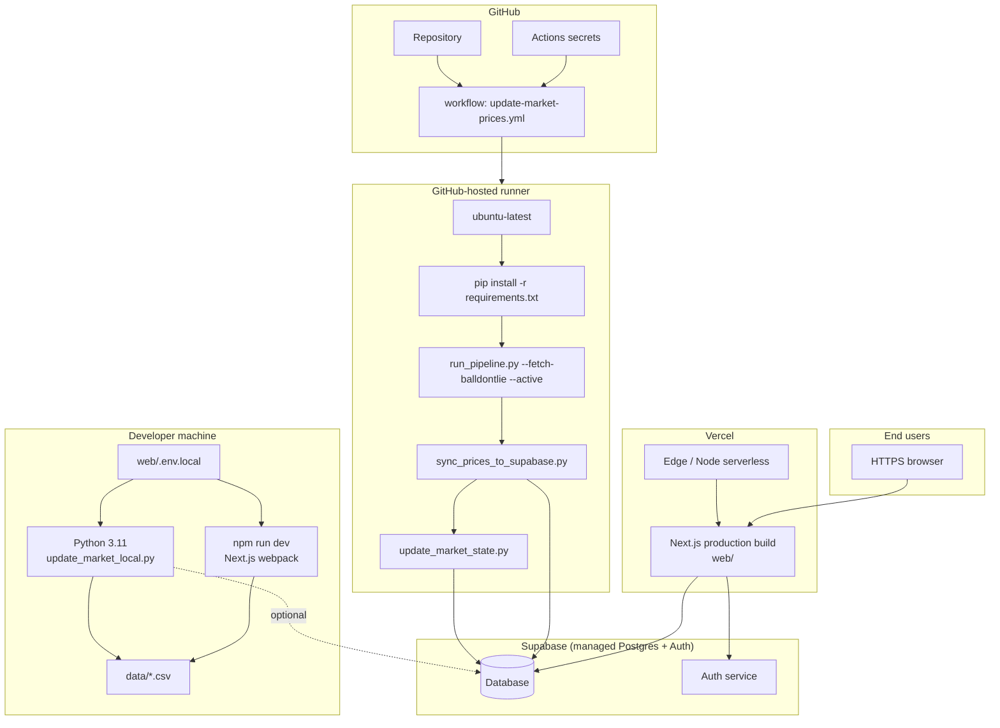
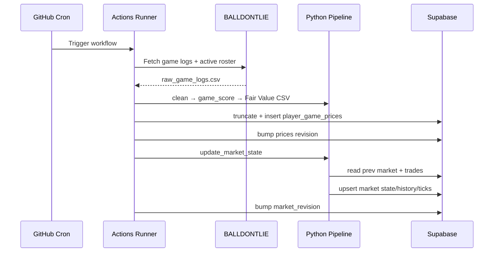
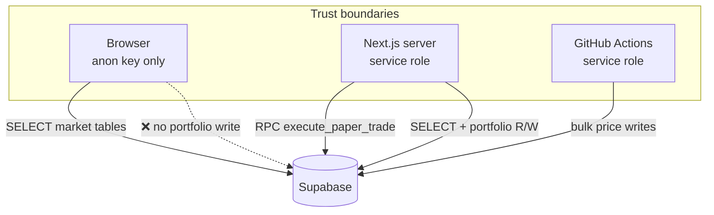

# Deployment Architecture

This document describes how the NBA Superstar Prediction platform is deployed across **local development**, **CI batch jobs**, and **hosted production** (Vercel + Supabase). It is written for infrastructure reviews and sports-tech recruiting discussions.

---

## 1. Deployment architecture diagram



---

## 2. Environment topology

| Environment | Web | Prices source | Pipeline | Portfolio DB |
|-------------|-----|---------------|----------|--------------|
| **Local default** | `localhost:3000` | CSV (`../data`) | Manual or `update_market_local.py` | Supabase (if env set) or N/A |
| **Local + hosted prices** | `localhost:3000` | `PRICES_SOURCE=supabase` | Same as prod sync | Supabase |
| **Production** | Vercel URL | `PRICES_SOURCE=supabase` | GitHub Actions cron | Supabase |

There is **no separate staging stack** defined in-repo; teams typically use a second Supabase project + Vercel preview env with duplicate secrets.

---

## 3. Secrets and configuration

### 3.1 GitHub Actions (repository secrets)

| Secret | Used by |
|--------|---------|
| `BALLDONTLIE_API_KEY` | `run_pipeline.py --fetch-balldontlie` |
| `SUPABASE_URL` | `sync_prices_to_supabase.py`, `update_market_state.py` |
| `SUPABASE_SERVICE_ROLE_KEY` | Same (server-side pipeline writes) |

Workflow: `.github/workflows/update-market-prices.yml`

- **Schedule:** `15,45 * * * *` UTC
- **Timeout:** 45 minutes
- **Concurrency:** `update-market-prices` group, no cancel-in-progress
- **Permissions:** `contents: read` only

### 3.2 Vercel / `web/.env.local` (server + public)

| Variable | Exposure | Purpose |
|----------|----------|---------|
| `NEXT_PUBLIC_SUPABASE_URL` | Public | Supabase project URL |
| `NEXT_PUBLIC_SUPABASE_ANON_KEY` | Public | RLS-scoped reads |
| `SUPABASE_SERVICE_ROLE_KEY` | **Server only** | Portfolio + trade RPC |
| `PRICES_SOURCE` | Server | `supabase` for hosted mode |
| `PRICES_SUPABASE_PAGE_SIZE` | Server | Pagination size (≤ API max rows) |
| `BALLDONTLIE_API_KEY` | Local pipeline | Not needed on Vercel unless running fetch in preview |

**Never** prefix `SUPABASE_SERVICE_ROLE_KEY` with `NEXT_PUBLIC_`.

### 3.3 Optional pipeline tuning

| Variable | Default | Notes |
|----------|---------|-------|
| `BALLDONTLIE_REQUEST_PAUSE_SECONDS` | 1.05 | Increase on HTTP 429 |
| `BALLDONTLIE_PER_PAGE` | 100 | Max 100 |
| `PRICES_FETCH_SOURCE` | `balldontlie` | `nba_api` for deprecated path |

---

## 4. CI/CD pipeline (production data path)



**Deploy coupling:** Vercel deploys are **independent** of price updates. The app polls revision fields on each request (cache keys). No redeploy required after pipeline success.

---

## 5. Web application deployment (Vercel)

### Build

```bash
cd web && npm run build
```

`package.json` runs `next build` then `scripts/vercel-link-next-output.mjs` for Vercel output linking.

### Runtime

- **Framework:** Next.js 16 (App Router)
- **Dev default:** Webpack (`next dev --webpack`) — avoids Turbopack path-length issues on Windows
- **Production:** Server Components + Route Handlers on Node serverless functions

### Path resolution

- `getDataDir()` → `../data` from `web/` cwd
- Production **does not** rely on `data/` when `PRICES_SOURCE=supabase`

### Recommended Vercel settings

- Root directory: `web/` (or monorepo config pointing to `web`)
- Install: `npm ci`
- Env: all Supabase vars + `PRICES_SOURCE=supabase`
- Supabase dashboard: **API Max rows** ≥ `PRICES_SUPABASE_PAGE_SIZE`

---

## 6. Database deployment (Supabase)

- **No automated migration runner** in CI; SQL files under `supabase/` are applied manually in SQL Editor.
- **Auth:** Email/password + OAuth callback at `web/app/auth/callback/route.ts`
- **RLS:** Public read on market tables; portfolio tables service-role only

See [DATABASE_ARCHITECTURE.md](./DATABASE_ARCHITECTURE.md) for migration order.

---

## 7. Local deployment alternatives

| Approach | Command | Use when |
|----------|---------|----------|
| Dev server only | `cd web && npm run dev` | UI work against existing CSV |
| Full local refresh | `python pipeline/update_market_local.py` | Match production data |
| CSV-only pipeline | `run_pipeline.py` + manual sync | No Supabase |
| Windows Task Scheduler | `update_market_local.py` on interval | No GitHub Actions |

**Windows note:** Long repo paths can break Turbopack; use short clone path (e.g. `C:\dev\nba-market`) or Webpack dev script.

---

## 8. Security architecture



- Portfolio mutation only via authenticated `/api/trade` → service role RPC
- Guest users map to demo portfolio UUID (`PAPER_PORTFOLIO_ID`)
- Signed-up users get portfolio via `handle_new_user` trigger

---

## 9. Observability (current state)

| Signal | Available? |
|--------|------------|
| Pipeline stdout | GitHub Actions logs |
| Price revision timestamps | `prices_snapshot_meta.updated_at`, `market_updated_at` |
| APM / metrics | Not in-repo |
| Alerting on workflow failure | GitHub default (optional notifications) |

**Gap:** No centralized dashboard for “last successful price update” or data freshness SLAs.

---

## 10. Design decisions

| Decision | Rationale |
|----------|-----------|
| GitHub Actions over Vercel Cron for fetch | Long-running Python + pandas ill-suited to serverless timeout |
| Twice-hourly schedule | Balance freshness vs API cost; offset :15/:45 avoids :00 UTC congestion |
| Vercel for web only | Best-in-class Next.js hosting; compute-heavy work stays in Actions |
| Manual SQL migrations | Small team velocity; explicit review per schema change |
| Service role in CI | Same write path as local `update_market_local.py`; one permission model |

---

## 11. Current bottlenecks

| Bottleneck | Impact |
|------------|--------|
| Single workflow job | No partial success artifacts; 45 min max runtime |
| No staging environment in repo | Schema mistakes hit production meta tables |
| Serverless cold starts | First market page load after idle may be slow (cache miss + Supabase paging) |
| Secret sprawl | Same service role in CI and Vercel increases blast radius if leaked |
| No blue/green DB deploy | Truncate window during sync |

---

## 12. Future scaling improvements

1. **Split workflows** — `ingest.yml`, `fair-value.yml`, `market.yml` with shared artifacts.
2. **Dedicated staging Supabase** — preview Vercel env + separate secrets.
3. **Observability** — Datadog/Sentry on Next.js; pipeline success metric to Grafana.
4. **Supabase Edge Function** — lightweight health endpoint returning `revision` / lag.
5. **Rotate keys** — separate service role for CI vs runtime trade RPC.
6. **Vercel ISR** — cache market board HTML keyed by `market_revision`.
7. **Self-hosted runner** — if BALLDONTLIE IP rate limits differ by egress.
8. **Infrastructure as Code** — Terraform for Supabase/Vercel env parity.

---

## 13. Quick reference — production checklist

- [ ] Supabase SQL migrations applied in order
- [ ] `lockdown_paper_portfolio.sql` if upgrading legacy deploy
- [ ] GitHub secrets: `BALLDONTLIE_API_KEY`, `SUPABASE_URL`, `SUPABASE_SERVICE_ROLE_KEY`
- [ ] Workflow enabled and green at least once
- [ ] Vercel env: `PRICES_SOURCE=supabase`, Supabase keys, service role server-only
- [ ] Supabase API max rows ≥ page size
- [ ] Verify `prices_snapshot_meta.revision` increments after CI run

---

## Related documents

- [SYSTEM_ARCHITECTURE.md](./SYSTEM_ARCHITECTURE.md)
- [DATA_PIPELINE.md](./DATA_PIPELINE.md)
- [DATABASE_ARCHITECTURE.md](./DATABASE_ARCHITECTURE.md)
