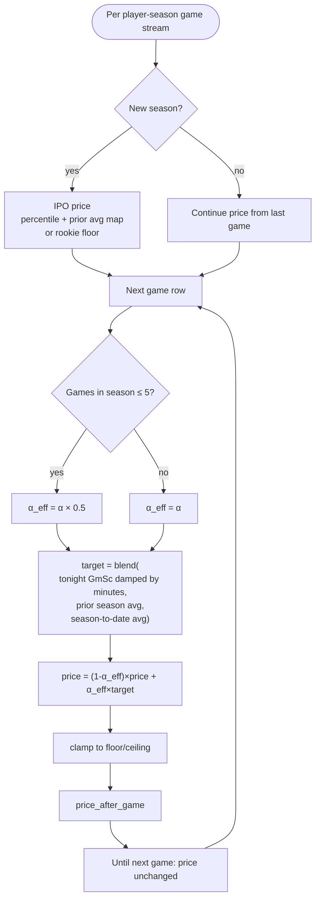
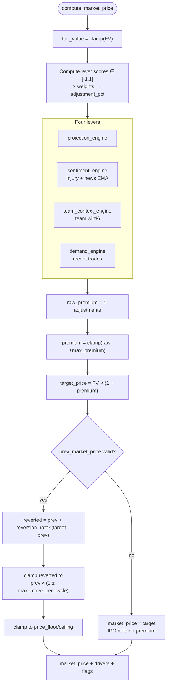
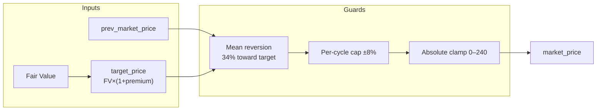
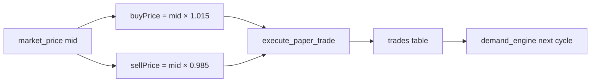

# Market & Pricing Engine

The platform implements a **two-layer pricing model** inspired by fundamental value vs exchange-traded price. Layer 1 is pure basketball analytics; Layer 2 is an explainable, manipulation-resistant market simulator fed by performance trends, news, team context, and user order flow.

All parameters for Layer 2 live in `pipeline/market_config.py` (`MarketConfig`). Layer 1 constants are in `pipeline/price_engine.py`.

---

## 1. Conceptual model

| Concept | Symbol / field | Meaning |
|---------|----------------|---------|
| Fair Value | `fair_value`, `price_after_game` | Statistically justified price after each game |
| Market Price (mid) | `market_price` | Tradable quote; may premium/discount vs Fair Value |
| Premium | `(market - fair) / fair` | Bounded by `max_premium` (default ±15%) |
| Target | `fair × (1 + Σ lever adjustments)` | Where mean reversion pulls the mid |
| Fill price | `fillPrice(mid, side)` | Mid ± half-spread (web layer, not pipeline) |

**Invariant:** Trades never write Market Price directly. They append `trades` rows that influence the **demand lever** on the next market cycle.

---

## 2. Fair Value engine flowchart (Layer 1)

### IPO (season open anchor)

- **Prior-season signal:** Minutes-adjusted mean game score → league percentile dollars + direct mapping (`IPO_PCT_WEIGHT` / `IPO_AVG_MAP_WEIGHT`).
- **Rookies / low sample:** `ROOKIE_IPO_PRICE` near floor of tradable range.
- **Minimum games:** Prior season needs enough games (`MIN_PRIOR_GAMES`) for full anchor; else fallbacks apply.

### Live game update

Smoothing target weights (`WEIGHT_TONIGHT`, `WEIGHT_PRIOR_YEAR`, `WEIGHT_SEASON_AVG`) balance recency vs reputation vs current-season proof.

**Why smoothing:** A single 50-point explosion does not 10× a player’s price; careers and seasons matter.

---

## 3. Market engine flowchart (Layer 2)

### Lever summary (`DEFAULT_CONFIG`)

| Lever | Max adjustment (% of FV) | Primary inputs |
|-------|--------------------------|----------------|
| Projection | ±6% | Last 5 / 10 games vs season & prior anchors; minutes trend |
| Sentiment | ±4% | ESPN injury severity; RSS headlines (VADER); EMA vs prior cycle |
| Team context | ±3% | Current-season team win% from game results |
| Demand | ±5% | Recency-weighted net shares; per-portfolio cap 150 shares |

**Combined premium cap:** ±15% (`max_premium`) even if raw sum exceeds.

**Movement cap:** ±8% per cycle (`max_move_per_cycle`) vs previous market price.

**Mean reversion:** `reversion_rate = 0.34` closes 34% of gap to target each ~30 min cycle.

---

## 4. Pricing engine flowchart (target + reversion detail)

This expands the **non-cold-start** path for design reviews:

**Why two caps (premium band + move cap):** When Fair Value jumps after a big game, target moves immediately but tradable price **ratchets** over multiple cycles. Prevents pump-and-dump on scheduled stat updates while still converging.

---

## 5. Lever modules (deep dive)

### 5.1 Projection (`projection_engine.py`)

Signals (weighted):

- Recent trend (last 5 vs season baseline)
- Long form (last 10 vs prior-season anchor)
- Minutes trend (opportunity)

Mapped via `tanh(delta / scale)` to [-1, 1].

**Age / development curve (live):** `player_profiles.csv` supplies birth date and
position (G/F/C). Peak ages follow MDPI (2024) position splits — Guards **29.5**,
Forwards **27.5**, Centers **25.5** — with `AGE_WEIGHT = 0.12` so form/minutes
still dominate. Younger-than-peak players get a modest market premium; past-prime
a discount (e.g. 22yo center vs ~27yo guard).

### 5.2 Sentiment (`sentiment_engine.py` + `news_sentiment.py` + `espn_injuries.py`)

- **Injuries:** Severity from ESPN status; gated by `injury_active_window_days` (no league-wide discount in offseason).
- **News:** VADER polarity on RSS headlines; confidence scales with `article_count / sentiment_full_confidence_articles`.
- **EMA:** `sentiment_smoothing = 0.5` blends with previous cycle’s score.

### 5.3 Team context (`team_context_engine.py`)

- **Live:** `team_win_pct` from deduped W/L per team per game in current season CSV.
- **Dormant:** playoff seed, opportunity delta, schedule strength (interfaces ready).

### 5.4 Demand (`demand_engine.py`)

- Window: 7 days (`demand_window_days`)
- Recency weight: linear decay to zero at window edge
- Score: `tanh(net / demand_scale_shares)` with `demand_scale_shares = 500`
- Anti-whale: each `portfolio_id` contributes at most ±150 net weighted shares to signal

**Empty trades → score 0:** Pre-launch default; no code path change when users arrive.

---

## 6. Attribution and explainability

`market_engine._build_drivers()` produces human-readable strings:

- Per-lever dollar impact (adjustment × fair value)
- Flags: premium capped, move capped, cold start IPO
- Default copy when no lever fired: mean reversion toward Fair Value

Stored in Supabase `player_market_state.explanation` (JSON) for UI panels.

**Why:** Sports-tech and analytics hiring loops care about *interpretable* models, not black boxes.

---

## 7. Trading layer interaction (web)

Not part of Python engines but completes the economic model:

`HALF_SPREAD = 0.015` in `web/lib/tradeCosts.ts` (~3% round trip).

---

## 8. Configuration reference

Central file: `pipeline/market_config.py`

| Parameter | Default | Role |
|-----------|---------|------|
| `projection_weight` | 0.06 | Max projection premium fraction |
| `sentiment_weight` | 0.04 | Max sentiment premium fraction |
| `team_context_weight` | 0.03 | Max team context premium fraction |
| `demand_weight` | 0.05 | Max demand premium fraction |
| `max_premium` | 0.15 | Hard band around Fair Value |
| `max_move_per_cycle` | 0.08 | Anti-pump per cycle |
| `reversion_rate` | 0.34 | Mean reversion speed |
| `demand_window_days` | 7 | Trade lookback |
| `demand_user_cap_shares` | 150 | Per-user manipulation cap |
| `price_ceiling` | 240 | Shared absolute max |

Re-price experiments: instantiate custom `MarketConfig` in tests without editing engine code.

---

## 9. Design decisions

| Decision | Rationale |
|----------|-----------|
| No randomness | Reproducible tests; trustworthy demos |
| Levers as fractions of Fair Value | Scales with player caliber (superstar vs role player) |
| Sentiment does not move Fair Value | Fundamentals stay “true”; narrative is market overlay |
| Cold start at target | New listings behave like IPO at model fair + premium |
| Demand from real fills only | Organic path to user-driven prices without fake volume |
| Separate config dataclass | Staff can audit tunables in one file for design reviews |

---

## 10. Current bottlenecks

| Area | Issue |
|------|--------|
| Fair Value | Recomputes full history each pipeline run (no incremental) |
| Market | Single-threaded; external feeds add variable latency |
| Sentiment | RSS/ESPN availability; no paid news API |
| Demand | Low trade volume → lever often zero (by design, but limits “market feels alive”) |
| Spread | Fixed 1.5%; not volatility-adjusted per player |

---

## 11. Future scaling improvements

1. **Player-specific volatility** — widen `max_move_per_cycle` for rookies, tighten for veterans.
2. **Bayesian Fair Value** — injury-adjusted expected minutes in Layer 1 (not just Layer 2).
3. **Order book simulation** — depth beyond mid + fixed spread.
4. **Lever calibration UI** — admin tool to backtest `MarketConfig` against historical ticks.
5. **ML projection sub-signal** — plug in RAPM/EPM as additional projection input without changing market_engine API.
6. **Real-time game feed** — intra-game Fair Value updates (requires play-by-play ingestion).
7. **Circuit breakers** — halt trading when `move_capped` fires N cycles in a row (exchange-style).

---

## Related documents

- [DATA_PIPELINE.md](./DATA_PIPELINE.md) — when engines run in CI
- [DATABASE_ARCHITECTURE.md](./DATABASE_ARCHITECTURE.md) — where results persist
- [SYSTEM_ARCHITECTURE.md](./SYSTEM_ARCHITECTURE.md) — system context
