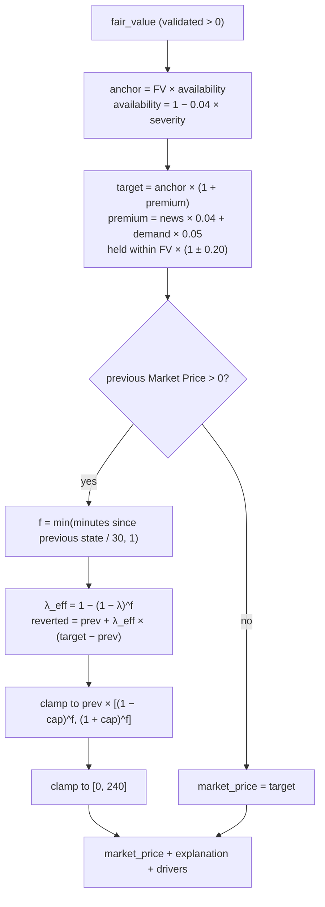
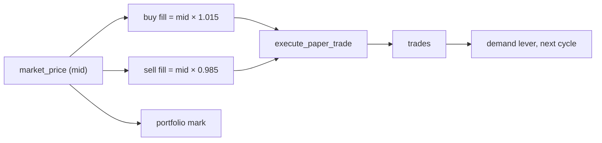

# Market & Pricing Engine

The platform implements a **two-layer pricing model**:

```
game data → basketball performance model → Fair Value
          → market overlay (availability, news, demand) → Market Price (mid)
          → trades / portfolio → demand → next Market Price
```

Layer 1 (**Fair Value**) is the only place basketball performance is priced. Layer 2
(**Market Price**) is a deterministic, explainable, rate-limited overlay that adds what a
box score cannot know: whether the player is available, what the news says, and where
users are trading.

Layer 1 constants live in `pipeline/price_engine.py`; every Layer 2 tunable lives in
`pipeline/market_config.py` (`MarketConfig`). The current methodology is tagged
`PRICING_MODEL_VERSION = "2026-10-fv2-mkt2"` and written into every
`player_market_state.explanation`.

---

## 1. Conceptual model

| Concept | Field | Meaning |
|---------|-------|---------|
| Fair Value | `player_game_prices.price_after_game`, `player_market_state.fair_value` | Basketball value after each game (Layer 1) |
| Availability factor | `explanation.availability.factor` | `1 − 0.04 × injury severity`; 1.0 when not listed |
| Anchor | `explanation.anchor_price` | `Fair Value × availability factor` |
| Premium | sum of weighted levers | News sentiment (±4%) + demand (±5%) |
| Target | `explanation.target_price` | `anchor × (1 + premium)`, held within ±20% of Fair Value |
| Market Price (mid) | `player_market_state.market_price` | Tradable mid; moves toward target each cycle |
| `premium_pct` | `(market − fair) / fair` | Always vs **box-score Fair Value** (includes the availability discount) |
| Fill price | `fillPrice(mid, side)` | Mid ± 1.5% half-spread (`web/lib/tradeCosts.ts`) |
| Portfolio mark | `PositionRow.price` | Market Price mid; Fair Value if the market layer is missing; average cost as a last resort |

**Invariant:** trades never write Market Price. They append `trades` rows that feed the
demand lever on the next market cycle.

---

## 2. Fair Value engine (Layer 1)

### 2.1 One minutes methodology

Every production measure uses the **effective game score**

```
g* = game_score × minutes_factor(minutes),   minutes_factor = clamp(minutes / 34, 0.22, 1.08)
```

Tonight's game, the season-to-date average, the prior-season anchor and the season-open
IPO all use `g*`. (Before `fv2`, the IPO used a separate `(mpg / 32)^1.2` curve and the live
averages used raw game score; the two curves agree closely at typical minutes — 20 mpg is
0.59 vs 0.57 — so one curve replaces both.)

Rows with `minutes ≤ 0` (DNP / inactive) are **not games**: they do not enter averages,
counts or the surprise z-score, and Fair Value carries forward unchanged.

### 2.2 Season open (IPO)

```
c      = min(prior_games / 25, 1)                       # sample confidence
anchor = 0.45 × percentile_dollars + 0.55 × map(prior mean g*)
IPO    = c × anchor + (1 − c) × ROOKIE_IPO_PRICE        # ROOKIE_IPO_PRICE = $61.80
```

- `percentile_dollars = 45 + pct × 140`, where `pct` is the league percentile of the prior-season
  mean `g*` among players with ≥ 20 played games (if unranked, `anchor = map(prior mean g*)`).
- `map(g)` is the linear map `−3 → $45`, `34 → $185`, clamped.
- The confidence weight replaces the old 25-game cliff (24 prior games used to open at the
  rookie price, 25 at the full anchor). One extra game now moves the open by at most 1/25 of
  the anchor–default gap. 479 of 4,466 player-seasons in the local history had 1–24 prior games.

### 2.3 Each played game

```
z         = (g*_tonight − mean g*_season) / max(std, 3)        (0 for the first game; std = 8 with one prior game)
w_tonight = 0.40 if |z| ≥ 1.5 else 0.30
w_prior   = (1 − w_tonight) × 0.5 × c                           (0 with no prior season)
w_season  = (1 − w_tonight) − w_prior
target    = w_tonight × map(g*_tonight) + w_prior × map(prior mean g*) + w_season × map(season mean g*)
α_eff     = 0.30 × (0.5 if games_in_season ≤ 5 else 1) × (1 + 0.5 × min(|z|, 2))
price     = clamp((1 − α_eff) × price + α_eff × target, 0, 240)
```

`prior_confidence = 0` is exactly the no-prior-season formula, so the prior anchor fades
in smoothly with sample size.

**Validation** (`validate_prices.py`): every price must be finite, `> 0` and `≤ 240`, and
`(player_id, game_id, game_date)` unique. A zero or missing Fair Value fails the run, and
`sync_prices_to_supabase.py` independently refuses to truncate/reload if any row is `≤ 0`.

**Restatement impact (local history, `fv1` → `fv2`):** latest Fair Value for 582
current-season players moved by a median −4.2% (IQR −6.1% to −2.3%), because season
averages are now minutes-adjusted. Player ranking is preserved (Spearman 0.99).

---

## 3. Market engine (Layer 2)


```mermaid
flowchart TD
  FV["fair_value (validated > 0)"] --> AV["anchor = FV × availability<br/>availability = 1 − 0.04 × severity"]
  AV --> TGT["target = anchor × (1 + premium)<br/>premium = news × 0.04 + demand × 0.05<br/>held within FV × (1 ± 0.20)"]
  TGT --> COLD{previous Market Price > 0?}
  COLD -->|no| SEED["market_price = target"]
  COLD -->|yes| F["f = min(minutes since previous state / 30, 1)"]
  F --> REV["λ_eff = 1 − (1 − λ)^f<br/>reverted = prev + λ_eff × (target − prev)"]
  REV --> CAP["clamp to prev × [(1 − cap)^f, (1 + cap)^f]"]
  CAP --> ABS["clamp to [0, 240]"]
  ABS --> OUT["market_price + explanation + drivers"]
  SEED --> OUT
```

### 3.1 Levers (`DEFAULT_CONFIG`)

| Lever | Weight | In price? | Inputs |
|-------|--------|-----------|--------|
| Availability | 4% × severity (on the anchor) | Yes | ESPN status → severity (`espn_injuries.STATUS_SEVERITY`: Out For Season 1.0, Out 0.8, Doubtful/Suspension 0.6, Questionable/GTD 0.35, Day-To-Day 0.25) |
| News sentiment | ±4% | Yes | RSS headlines (VADER), confidence `min(1, articles / 3)`, EMA 0.60 vs previous cycle |
| Demand | ±5% | Yes | Recency-weighted net shares over 7 days, `tanh(net / 500)`, each portfolio capped at ±150 shares |
| Projection | 0 | **No** (stored) | Recent form / long form / minutes trend / age — used by Radar and outlook |
| Team context | 0 | **No** (stored) | Team win % — shown, not priced |

**Why projection and team context carry weight 0.** Both are computed from the same box
scores that already drive Fair Value, so pricing them counts performance twice. The
backtest (`research/outputs/full_historical_2018_2026/evaluation_panel.csv`, 104,396
player-days, 2018–2026) also shows the projection score is *negatively* related to the
next Fair Value move: Spearman −0.245 (mean daily −0.249 over 1,081 days), with forward
Fair Value return falling monotonically from +2.21% in the lowest projection decile to
−1.74% in the highest. A projection premium therefore pushed Market Price the wrong way
(Fair Value's EMA catches up to form before the market premium does). Projection does rank
future *game-score improvement* (ρ 0.083; minutes trend 0.132), which is why it stays
in the Radar. Under `fv1` this premium ranged −7.9% to +8.3% across 525 active players.

**Why availability is on the anchor, not in sentiment.** An injury is about whether the
player plays, not how well. It previously flowed through the sentiment lever (also 4%
max), where it shared a clamp and an EMA with news. It now has its own factor, keeping
the same severity map and the same 4% maximum, and `sentiment_score` is **news only**.
The discount persists for as long as ESPN lists the player — Fair Value carries forward
while he is out, so the absence is not already priced — and is switched off league-wide
when the last league game is more than 10 days old (offseason).

### 3.2 Cycle timing and guards

| Parameter | Default | Role |
|-----------|---------|------|
| `reversion_rate` λ | 0.45 | Share of the gap to target closed per full 30-minute cycle |
| `max_move_per_cycle` | 0.10 | Max move per full cycle |
| `event_reversion_rate` / `event_max_move_per_cycle` | 0.70 / 0.18 | Game-night cycle (Fair Value moved ≥ 2% vs the stored state under the same model version) |
| `nominal_cycle_minutes` | 30 | Defines one cycle; `f = elapsed / 30`, capped at 1 |
| `max_premium` | 0.20 | Target never more than ±20% from Fair Value |
| `price_floor` / `price_ceiling` | 0 / 240 | Absolute clamp (same ceiling as Fair Value) |

The scaling is exact under composition: two runs at `f = 0.5` give the same price as one
run at `f = 1` (reversion `1 − (1 − λ)^f`, caps `(1 ± cap)^f`). An immediate re-run
(`f ≈ 0`) leaves prices unchanged, and a long outage counts as one cycle, never more.
Unknown elapsed time (no stored `updated_at`) counts as one full cycle — the previous behaviour.

**Model-version boundary:** if the stored explanation has a different (or no)
`pricing_model_version`, the cycle does not enter game-night mode and does not carry over
the previous `sentiment_score` (which used to include injury). Market Price then converges
to the new target at the normal rate (≤ 10% per cycle) — no gaps.

---

## 4. Pipeline robustness (`update_market_state.py`)

| Situation | Behaviour |
|-----------|-----------|
| `player_market_state` read fails | Abort before any write (only "table missing" = first run → cold start) |
| `trades` read fails | Abort before any write (only "table missing" → demand 0) |
| Fair Value missing / `≤ 0` for a player | Player skipped; previous state left untouched |
| Previous Market Price missing / `≤ 0` | Cold start at target |
| Re-run / duplicate Action run | Time scaling makes the second run a near no-op; ticks are append-only |
| ESPN / RSS feed down | Fail-safe: no discount / neutral news |

**Coherent publication.** CI runs `sync_prices_to_supabase.py --defer-revision-bump`,
then `update_market_state.py`, which upserts state → history → ticks and finally calls
`publish_pricing_revision(p_model_version)` (`supabase/pricing_revision.sql`). That bumps
`revision` and `market_revision` in one statement, so the web cache switches to the new
Fair Value and the new Market Price together. If the RPC is not installed, it falls back to
`bump_prices_revision()` + `bump_market_revision()`. If the market step fails, neither
revision moves, and warm web caches keep serving the previous coherent pair.

Remaining limitation: the sync still truncates and reloads `player_game_prices`, so a
*cold* web instance that reads during the reload can see a partial table until the run
finishes (warm instances are protected by the revision key).

---

## 5. Explainability

`MarketPriceResult.explanation()` (stored in `player_market_state.explanation`) contains
`fair_value`, `anchor_price`, `availability {factor, severity, status, adjustment_pct}`,
`target_price`, `premium_pct`, per-lever `{score, weight, adjustment_pct}`,
`elapsed_cycle_fraction`, `event_mode`, `pricing_model_version`, caps flags and
human-readable `drivers` (e.g. "Availability −3.2% — injury: Out"). Levers with zero
adjustment are not narrated.

---

## 6. Trading and portfolio (web)


```mermaid
flowchart LR
  MID["market_price (mid)"] --> BUY["buy fill = mid × 1.015"]
  MID --> SELL["sell fill = mid × 0.985"]
  BUY --> RPC["execute_paper_trade"]
  SELL --> RPC
  RPC --> TRADES["trades"]
  TRADES --> DEM["demand lever, next cycle"]
  MID --> MARK["portfolio mark"]
```

- Holdings are marked at the **same mid trades fill around** (`web/lib/portfolioMath.ts`),
  so unrealized P&L right after a buy equals the half-spread, and liquidation value differs
  from the mark by at most 1.5%. Before this change holdings were marked at Fair Value.
- If the market layer is unavailable the mark falls back to Fair Value, then to average
  cost (`priceSource` says which) — a missing quote never values a holding at $0.
- `loadMarketStates()` never caches a failed read; it serves the last good map and retries.
- The board pairs each Market Price with the `fair_value` stored on the same state row.

**Manipulation bound.** Demand moves the target by at most 5%, the price moves at most
10% per cycle, and a round trip costs ~3%. Per-portfolio capping stops a single whale;
many accounts can together reach the 5% ceiling but not exceed it.

---

## 7. Configuration reference

| Parameter | Default |
|-----------|---------|
| `projection_weight` | 0.0 (diagnostic) |
| `sentiment_weight` | 0.04 |
| `team_context_weight` | 0.0 (diagnostic) |
| `demand_weight` | 0.05 |
| `availability_max_discount` | 0.04 |
| `max_premium` | 0.20 |
| `max_move_per_cycle` / `event_max_move_per_cycle` | 0.10 / 0.18 |
| `reversion_rate` / `event_reversion_rate` | 0.45 / 0.70 |
| `event_fair_value_jump_threshold` | 0.02 |
| `nominal_cycle_minutes` | 30 |
| `demand_window_days` / `demand_scale_shares` / `demand_user_cap_shares` | 7 / 500 / 150 |
| `sentiment_news_half_life_days` / `sentiment_full_confidence_articles` / `sentiment_smoothing` | 3 / 3 / 0.60 |
| `injury_active_window_days` (offseason gate) | 10 |
| `price_floor` / `price_ceiling` | 0 / 240 |

Experiments: construct a custom `MarketConfig` (e.g. `MarketConfig(projection_weight=0.09)`,
as `research/signals.py` does for its counterfactual replay) without editing engine code.

---

## 8. Design decisions

| Decision | Rationale |
|----------|-----------|
| No randomness, no ML, no order book | Reproducible tests; every dollar is attributable |
| Performance priced once (Fair Value) | Avoids double-counting; backtest shows the projection premium was wrong-signed |
| Availability on the anchor | Injury is about playing time, not quality; counted once |
| Time-scaled cycles | Re-runs and delayed cron runs cannot compound movement |
| Abort on read failure | A failed read must not look like "no history" and mass cold-start |
| Mark at mid | Portfolio value matches the price users actually trade around |
| Additive schema only | `pricing_revision.sql` adds a nullable column and one function; nothing dropped |

---

## 9. Known limitations

| Area | Issue |
|------|-------|
| Fair Value | Recomputed from full history each run (deterministic, not incremental) |
| Sync | Truncate + reload; cold readers can see a partial table mid-reload |
| Availability | ESPN listing quality; no expected-minutes model |
| Demand | Many coordinated accounts can reach (not exceed) the 5% demand ceiling |
| Spread | Fixed 1.5%; not volatility-adjusted |

---

## Related documents

- [DATA_PIPELINE.md](./DATA_PIPELINE.md) — when engines run in CI
- [DATABASE_ARCHITECTURE.md](./DATABASE_ARCHITECTURE.md) — where results persist
- [SYSTEM_ARCHITECTURE.md](./SYSTEM_ARCHITECTURE.md) — system context
