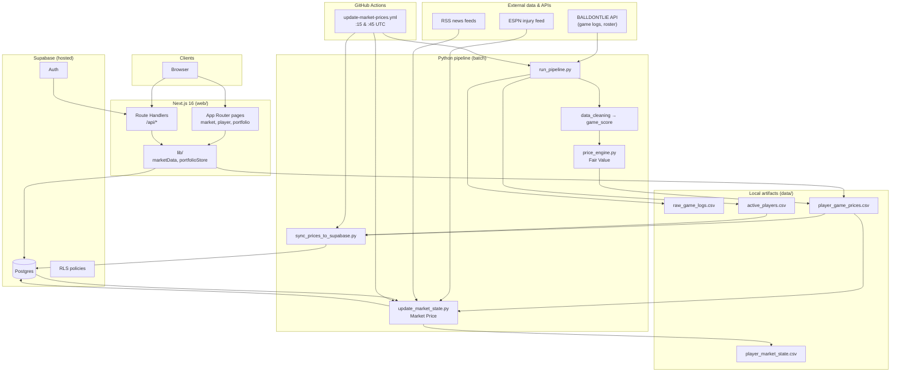
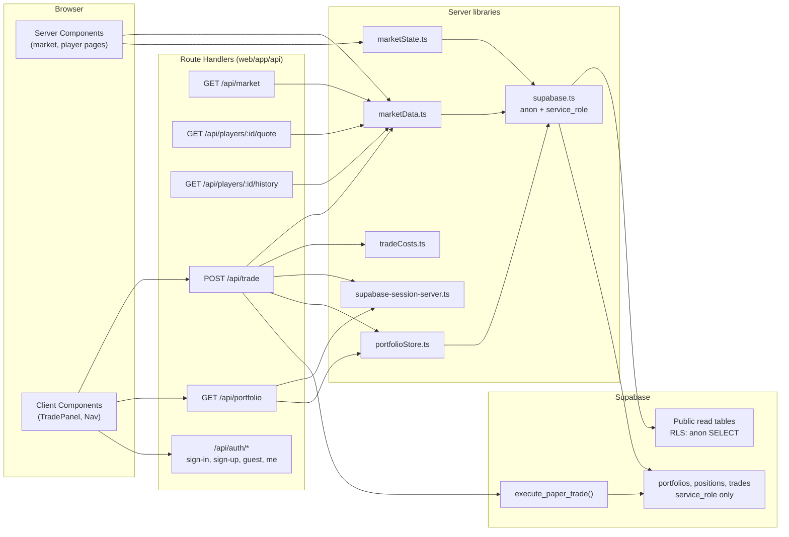

# System Architecture

**NBA Superstar Prediction** is a paper-trading platform where NBA players are modeled as tradable assets. The system separates **basketball fundamentals** (Fair Value, Layer 1) from **market dynamics** (Market Price, Layer 2), then exposes both through a Next.js web app backed by Supabase.

This document is intended for technical design reviews, recruiting conversations, and onboarding senior engineers.

---

## 1. System architecture diagram

---

## 2. API architecture diagram

The web tier uses **Next.js App Router Route Handlers** as a thin BFF (backend-for-frontend). Sensitive mutations never use the anon key on portfolio tables; they go through **service-role** server code.

### API surface

| Method | Path | Auth | Purpose |
|--------|------|------|---------|
| `GET` | `/api/market` | Optional | Full market board rows (Fair Value + Market Price + movers metadata) |
| `GET` | `/api/players/[id]/quote` | Optional | Latest fair-value game row + tradable market quote |
| `GET` | `/api/players/[id]/history` | Optional | Price history series for charts |
| `POST` | `/api/trade` | Required | Execute paper buy/sell at spread-adjusted fill price |
| `GET` | `/api/portfolio` | Required | Cash, positions, cost basis snapshot |
| `POST` | `/api/auth/sign-in` | — | Email/password session |
| `POST` | `/api/auth/sign-up` | — | Registration |
| `POST` | `/api/auth/guest` | — | Guest browse session |
| `GET` | `/api/auth/me` | Cookie | Current user |
| `GET` | `/auth/callback` | OAuth | Supabase auth redirect |

Server Components call `marketData.ts` directly (no HTTP hop). Client trade UI calls `/api/trade` so fill logic and spread application stay server-authoritative.

---

## 3. Component inventory

### 3.1 Python pipeline (`pipeline/`)

| Module | Role |
|--------|------|
| `balldontlie_fetch.py` | Primary ingestion: paginated game logs + active roster (BALLDONTLIE ids) |
| `data_collection.py` | Deprecated fallback: `stats.nba.com` via `nba_api` |
| `data_cleaning.py` | Normalize box scores → `cleaned_game_logs.csv` |
| `game_score.py` | Hollinger game score (GmSc) per game |
| `price_engine.py` | **Layer 1 — Fair Value** from game scores + season IPO anchors |
| `projection_engine.py` | Recent-form lever for Market Price target |
| `sentiment_engine.py` | Injury + news headline lever |
| `team_context_engine.py` | Team win% lever (from ingested W/L) |
| `demand_engine.py` | User trade-flow lever (recency-weighted, per-user capped) |
| `market_engine.py` | **Layer 2 — Market Price** (mean reversion, caps, attribution) |
| `market_config.py` | Central tunables for Layer 2 |
| `run_pipeline.py` | Orchestrates fetch → clean → score → fair value |
| `sync_prices_to_supabase.py` | Full reload of Fair Value tables + tickers |
| `update_market_state.py` | Incremental Market Price upsert + ticks |
| `update_market_local.py` | Local wrapper matching CI (pipeline + sync + market) |
| `validate_prices.py` | Sanity checks on Fair Value output |
| `ticker_assign.py` | Deterministic player tickers (mirrors `web/lib/playerTicker.ts`) |

### 3.2 Web application (`web/`)

| Area | Role |
|------|------|
| `app/` | App Router: landing, market board, player detail, portfolio, auth flows |
| `app/api/` | JSON Route Handlers (market, trade, portfolio, auth) |
| `lib/marketData.ts` | Price bundle loader (CSV or Supabase), merges Layer 1 + Layer 2 |
| `lib/marketState.ts` | Reads `player_market_state`, revision-based cache busting |
| `lib/portfolioStore.ts` | Service-role portfolio CRUD |
| `lib/tradeCosts.ts` | Bid/ask spread around Market Price mid |
| `components/` | UI: `MarketTable`, `TradePanel`, dashboards, charts (Recharts) |

### 3.3 Database (`supabase/*.sql`)

Migrations are applied manually in the Supabase SQL Editor (no automated migration runner in-repo). See [DATABASE_ARCHITECTURE.md](./DATABASE_ARCHITECTURE.md).

### 3.4 Automation (`.github/workflows/`)

`update-market-prices.yml` runs the full production refresh twice hourly on `ubuntu-latest`.

---

## 4. How data moves (request path)

**Read path (hosted):**

1. User opens `/market` → Server Component calls `getMarketRows()`.
2. `marketData.ts` checks `PRICES_SOURCE=supabase`, loads `prices_snapshot_meta.revision` and `market_revision`.
3. Paginated reads from `player_game_prices`, `active_players`, `player_board`, `player_market_state`.
4. In-memory bundle cache keyed by revision; invalidated when meta bumps after pipeline runs.

**Write path (trade):**

1. Client `POST /api/trade` with `player_id`, `side`, `shares`.
2. Server loads Market Price mid via `getMarketQuote()`, applies `fillPrice()` spread.
3. `execute_paper_trade` RPC atomically updates cash, positions, appends `trades` row.
4. Trade does **not** mutate Market Price directly; fills feed `demand_engine` on the next `update_market_state.py` cycle.

---

## 5. Design decisions (and rationale)

### Two-layer pricing

| Layer | Updates when | Purpose |
|-------|----------------|---------|
| **Fair Value** | After each logged game | Objective basketball value (Hollinger + smoothing) |
| **Market Price** | Every pipeline cycle (~30 min) | Tradable mid with explainable premiums, mean reversion, anti-manipulation caps |

**Why:** Separating fundamentals from market microstructure mirrors real exchanges, keeps backtests interpretable, and allows the UI to show both “what the stats say” vs “what the market is paying.”

### BALLDONTLIE as canonical player IDs

NBA.com ids (`nba_api`) and BALLDONTLIE ids are incompatible. Production standardizes on BDL end-to-end (fetch, CSV, Supabase, UI).

**Why:** Stable hosted ingestion without scraping `stats.nba.com`; explicit API contract and pagination.

### Service role for portfolio mutations

`portfolios`, `positions`, and `trades` have no `anon`/`authenticated` grants. Next.js Route Handlers use `SUPABASE_SERVICE_ROLE_KEY` server-side only.

**Why:** Paper money must not be client-writable; prevents trivial portfolio tampering via browser DevTools.

### Full truncate + reload for Fair Value

`sync_prices_to_supabase.py` truncates `player_game_prices` and re-inserts from CSV rather than incremental merges.

**Why:** Simpler correctness when historical rows can be recomputed; revision bump gives the app a cheap cache-invalidation signal. Trade-off: brief read inconsistency during reload (see bottlenecks).

### Market Price has memory

`player_market_state` is **upserted**, not truncated. Each cycle reads previous `market_price` and applies mean reversion toward a lever-adjusted target.

**Why:** Prices can move between games (sentiment, demand, drift) without random walks or instant jumps when Fair Value is flat.

### Deterministic engines (no RNG)

All lever scores and price moves are attributable; `explanation` JSON and driver strings are persisted.

**Why:** Auditable sports-analytics product suitable for demos, regression tests (`tests/test_*_engine.py`), and regulatory-style “why did price move?” questions.

### Bid/ask spread on trades

~1.5% half-spread each side (~3% round trip) applied in `trade/route.ts`.

**Why:** Closes risk-free arbitrage against a mean-reverting mid when Market Price sits away from Fair Value.

---

## 6. Current bottlenecks

| Bottleneck | Impact |
|------------|--------|
| **Monolithic CI job** | Fetch + Fair Value rebuild + full Supabase reload + market update in one 45-minute workflow; failure late in the job wastes prior steps. |
| **Fair Value full truncate** | Large `player_game_prices` table rewrite; readers may see empty/partial data mid-sync without blue/green tables. |
| **Paginated Supabase reads in Next.js** | `marketData.ts` may issue many range queries; default PostgREST max rows (often 1000) forces paging unless `PRICES_SUPABASE_PAGE_SIZE` and project limits are raised. |
| **In-process caches** | `bundleCache` / `activeSupabaseCache` live in the Node process; serverless cold starts and multi-instance deploys see duplicate reads until revision-based invalidation. |
| **BALLDONTLIE rate limits** | Full prior+current-season fetch is thousands of HTTP calls; local runs hit HTTP 429 more often than sparse CI schedules. |
| **Single-region batch writer** | `update_market_state.py` is sequential per player in Python; no parallel worker pool. |
| **External sentiment I/O in market step** | ESPN + RSS fetched synchronously each cycle; adds latency and failure modes unrelated to basketball data. |
| **`player_market_ticks` append-only growth** | Intraday chart feed grows unbounded without retention policy. |

---

## 7. Future scaling improvements

1. **Split CI into staged workflows** — ingest → fair value artifact → sync → market update, with artifact passing between jobs and independent retries.
2. **Blue/green price tables** — swap read pointer in `prices_snapshot_meta` after load completes (zero partial-read window).
3. **Materialized “latest price” view** — avoid scanning full game history on every market page load; keep `player_game_prices` as history store only.
4. **Edge caching / CDN** — cache `GET /api/market` with short TTL keyed by `market_revision` (public read data).
5. **Tick retention job** — partition or prune `player_market_ticks` older than N days; downsample to daily in `player_market_history`.
6. **Parallel market computation** — multiprocessing or worker queue per player batch for `update_market_state.py`.
7. **Read replicas** — route heavy analytics queries to replica; keep primary for trades RPC.
8. **Event-driven updates** — trigger market recompute on trade insert (debounced) instead of only cron, with caps unchanged.
9. **Separate sentiment service** — cache injury/news scores in Redis with TTL to decouple from core price pipeline latency.

---

## 8. Technology stack summary

| Layer | Technology |
|-------|------------|
| Frontend | Next.js 16, React 19, Tailwind 4, Recharts |
| API | Next.js Route Handlers |
| Auth | Supabase Auth (email, OAuth callback) |
| Database | Supabase Postgres + RLS |
| Batch compute | Python 3.11, pandas |
| Ingestion | BALLDONTLIE REST API |
| CI | GitHub Actions |
| Hosting (recommended) | Vercel (`web/`) + Supabase cloud |

---

## Related documents

- [DATA_PIPELINE.md](./DATA_PIPELINE.md) — end-to-end data flow
- [DATABASE_ARCHITECTURE.md](./DATABASE_ARCHITECTURE.md) — schema and RLS
- [MARKET_PRICING_ENGINE.md](./MARKET_PRICING_ENGINE.md) — Fair Value and Market Price algorithms
- [DEPLOYMENT_ARCHITECTURE.md](./DEPLOYMENT_ARCHITECTURE.md) — environments, secrets, CI/CD
